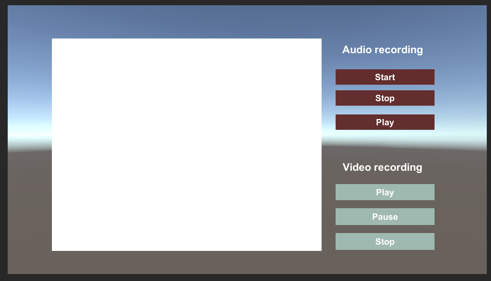

# Práctica 4: Micrófono y cámara
* Asignatura: Interfaces Inteligentes
* Vanessa Valentina Villalba Pérez
* Correo: alu0101265704@ull.edu.es

## Objetivos de la práctica y pasos realizados
El objetivo de esta práctica es aplicar las interfaces naturales en componentes con
Unity3D. Los componentes que se van a ver en esta práctica son la cámara y el micrófono del
ordenador o el teléfono móvil.

Como norma general, para la utilización de estos componentes se debe importar el paquete
UnityEngine. Hay que tener en cuenta que al probarse en el ordenador, muchos de los
componentes pueden devolver datos no realistas o directamente no funcionar. 

### Micrófono
En primer lugar, para poder acceder a los métodos de *Microphone* se crea un GameObject del tipo **Audio Source** al cual se le asigna un script capaz de controlar las acciones provenientes de los diferentes botones de control, los cuales están comprendidos por un botón de **Start** para comenzar la grabación del micrófono, un botón de **Stop** para detener la grabación del micrófono
y un botón de **Play** para reproducir el audio de salida.

Estas acciones vienen dadas por eventos del tipo *OnClick* que se encuentran previamente definidas para los botones en Unity. Y, para poder asignarles un método a ellos, se utiliza *AddListener*.

A continuación, se puede observar el código implementado:

[AudioRecordingHandler.cs](scripts/AudioRecordingHandler.cs)

 
```
public class AudioRecordingHandler : MonoBehaviour {
    public AudioSource microphone;
    Button startButton;
    Button stopButton;
    Button playButton;
    string microphoneName;

    void Start() {
        microphoneName = Microphone.devices[1];
        microphone = GameObject.Find("AudioSource").GetComponent<AudioSource>();
        startButton = GameObject.Find("StartAudio").GetComponent<Button>();
        startButton.onClick.AddListener(StartAction);
       
        stopButton = GameObject.Find("StopAudio").GetComponent<Button>();
        stopButton.onClick.AddListener(StopAction);
        
        playButton = GameObject.Find("PlayAudio").GetComponent<Button>();
        playButton.onClick.AddListener(PlayAction);
    }

    public void StartAction() {
        microphone.clip = Microphone.Start(microphoneName, true, 10, 44100);
    }

    public void StopAction() {
        if (Microphone.IsRecording(microphoneName)) {
            Microphone.End(microphoneName);
        }
    }

    public void PlayAction() {
        microphone.Play();
    }
}
```

### Cámara
Luego, para la cámara ya que se necesita de una "pantalla" para poder visualizar la grabación, se hace uso del Canvas de Unity, donde se contienen los botones (incluidos los utilizados en el apartado anterior) y un objeto UI del tipo *RawImage* donde se aplicará la textura correspondiente a la webCam. 

En este caso, se han implementado los siguientes botones: **Start** para empezar la grabación, **Pause** para congelar la pantalla y **Stop** para terminar la ejecución correspondiente a la activación de la webcam. Al igual que en el apartado anterior, estos botones tienen asignados ciertos métodos haciendo uso del *AddListener*.

A continuación, se puede ver el código implementado:

[PlayPauseButton.cs](scripts/PlayPauseButton.cs)

```
public class PlayPauseButton : MonoBehaviour {
    RawImage display;
    Button stopButton;
    Button playButton;
    Button pauseButton;
    WebCamTexture webCamTexture;

    public void Start() {
        display = GameObject.Find("RawImage").GetComponent<RawImage>();
        playButton = GameObject.Find("PlayVideo").GetComponent<Button>();
        playButton.onClick.AddListener(PlayAction);
       
        pauseButton = GameObject.Find("PauseVideo").GetComponent<Button>();
        pauseButton.onClick.AddListener(PauseAction);

        stopButton = GameObject.Find("StopVideo").GetComponent<Button>();
        stopButton.onClick.AddListener(StopAction);
    }

    public void PlayAction() {
        if (webCamTexture == null) {
            webCamTexture = new WebCamTexture(WebCamTexture.devices[1].name);
        }
        display.texture = webCamTexture;
        webCamTexture.Play();
    }
    
    public void PauseAction() {
        if (webCamTexture.isPlaying) {
            webCamTexture.Pause();
        }
    }
 
    public void StopAction() {
        if (webCamTexture != null) {
            display.texture = null;
            webCamTexture.Stop();
            webCamTexture = null;
        }
    }
}
```

## Game scene

* Imagen de la escena del juego.
  



* [Video demostrativo](https://drive.google.com/file/d/1AN92cMoJ0CwuomIJ-Qe18Gm79GjcxvH-/view?usp=sharing)
  
  **IMPORTANTE:** No hay una demostración del audio ya que hubieron problemas de entrada de audio al grabar el vídeo y mantener Unity ejecutándose a la vez. 

  